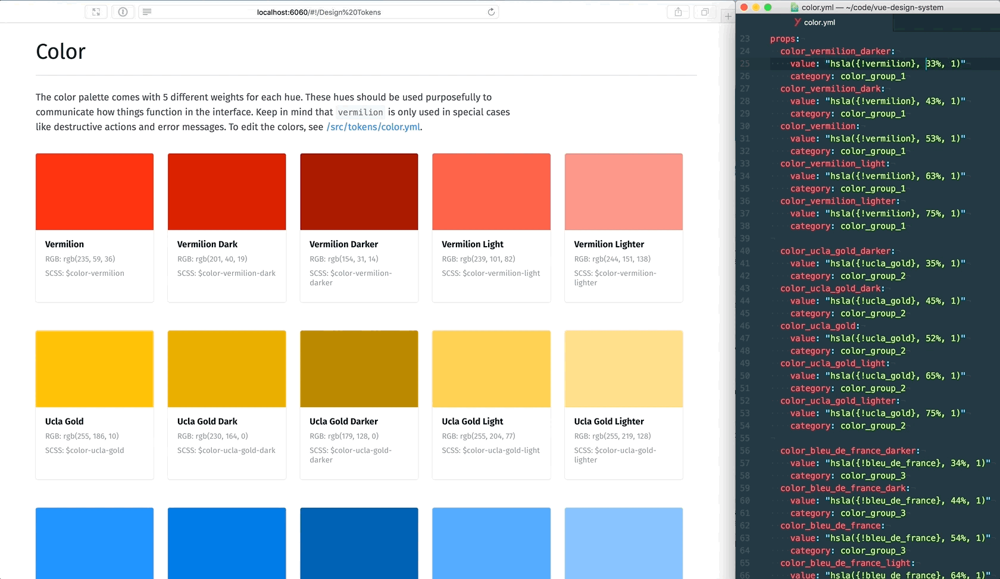

# VisitScotland Thistle Design System

This is the repository for the VisitScotland Design System, which is built on top of Vue Design System. It works in the same way as Vue Design System, with some changes:

- Running `npm install` does a _recursive_ install, so all sub-packages are also installed.
- The included components have been removed or modified to suit VisitScotland's needs and have all been namespaced with "Vs".
- An Svg component has been added.
- The `npm run stylguide` and `npm run styleguide:build` scripts make a request to the Contentful API to provide section, title and any other key of the docs config. The Contentful output is merged with docs/docs.config.js.

## Get Started with the documentation

The following commands will begin a development instance of the built design system documentation.

- `git clone https://llewis@bitbucket.visitscotland.com/scm/~llewis/vue-design-system.git thistle`
- `cd thistle`
- `npm install`
- `npm run build`
- `npm run styleguide`

## Building the design system documentation

The following commands will build a static version of the documentation at `dist/docs` and serve it using http-server on the default port:

- `npm install`
- `npm run build`
- `npm run styleguide:build`
- `npm run serve-docs`

## Remote docs content

It's possible to get the title and sections (pages) content for the documentation site from a remote API, during build. In order to do so:

- Edit `config/remote.config.js`, specifying sets of remote config profiles, each with URL, params and transforms. NOTE: the project already includes profiles for Contentful and Hippo.
- Set the `REMOTE_CONFIG_CONTENTFUL_SPACE` and `REMOTE_CONFIG_CONTENTFUL_TOKEN` environment variables - by specifying them in a `.env` file in the package root, or manually some other way.
- Run the remote styleguide scripts (`npm run docs:remote`, `npm run styleguide:remote` or `npm run styleguide:remote:build`) instead of the regular scripts.

By default, the build selects the first profile defined in the `config/remote.config.js` export. To select a different profile, alter the npm script to pass the name of the desired profile as the --remote-profile arg to the `build/styleguide` script, e.g:

```
    npm run docs:remote --remote-profile contentful
```

## Publishing the documentation to Heroku

If you are new to Heroku, [this guide](https://devcenter.heroku.com/articles/getting-started-with-nodejs) is a good guide to get you started with it.

The following commands will allow you to publsh the documentation site to a Heroku app.

- [Install Heroku locally](https://devcenter.heroku.com/articles/getting-started-with-nodejs#set-up)
- `cd thistle`
- `heroku create`
- `git push heroku master`

Pushing to the Heroku remote triggers the following npm scripts in order on the Heroku server:

- build (`npm-run-all theo node:build`)
- heroku-postbuild (`npm run build:docs:remote`)
- start (`http-server dist/docs -p $PORT`)

Editing any of those npm scripts will alter what occurs on the Heroku server.

## Vue Design System

[](https://travis-ci.org/viljamis/vue-design-system/)   [](https://gitter.im/vueds/Lobby)

[**Vue Design System**](https://vueds.com) is an open source tool for building UI Design Systems with [Vue.js](https://vuejs.org). It provides you and your team a set of organized tools, patterns & practices that work as the foundation for your application development.

Vue Design System is built on top of [Vue.js](https://vuejs.org), [Vue Styleguidist](https://github.com/vue-styleguidist/vue-styleguidist), [Webpack](https://webpack.js.org), and [Theo](https://github.com/salesforce-ux/theo) and is aimed for designers and front-end developers who have at least basic knowledge of component based workflows + HTML, SCSS & JavaScript.

**Made by [@viljamis](https://twitter.com/viljamis) and other contributors. See also [the official website](https://vueds.com) of Vue Design System and [read my article](https://viljamis.com/2018/vue-design-system/) on the processes and workflow I use to get started with a new design system project.**

[](https://vueds.com/)

## Ideas for improvement

- Add ability to have multiple `<docs>` examples output to component documentation and ability to insert named `<docs>` examples into documentation content
- Colour accessibility like Atlassian
- XD/Zeplin integration
- Icons page listing out all available icons as well as icon options & guidelines
